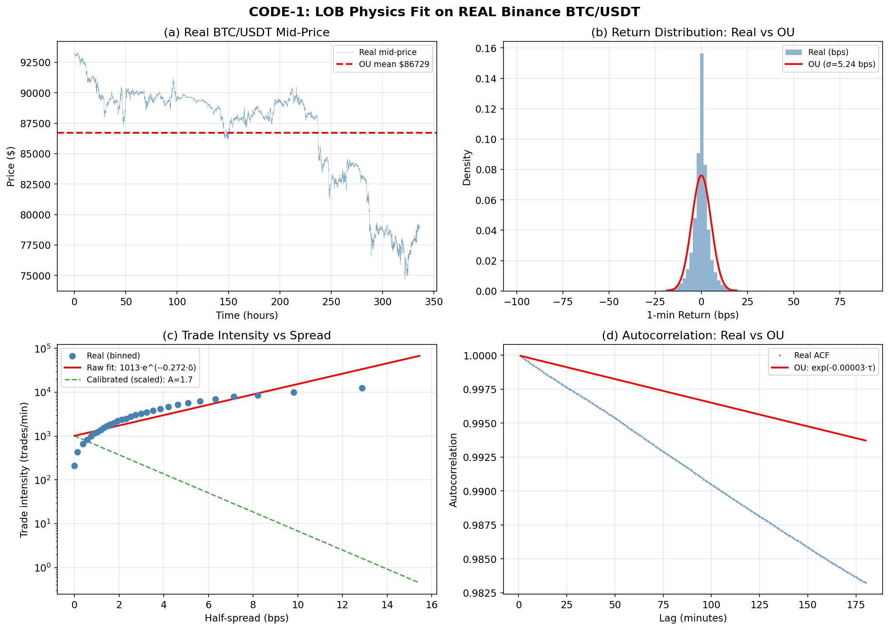
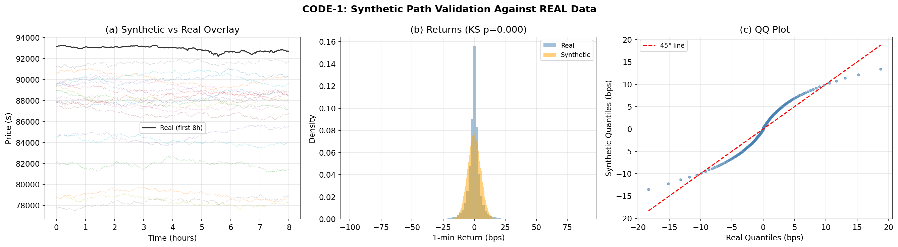
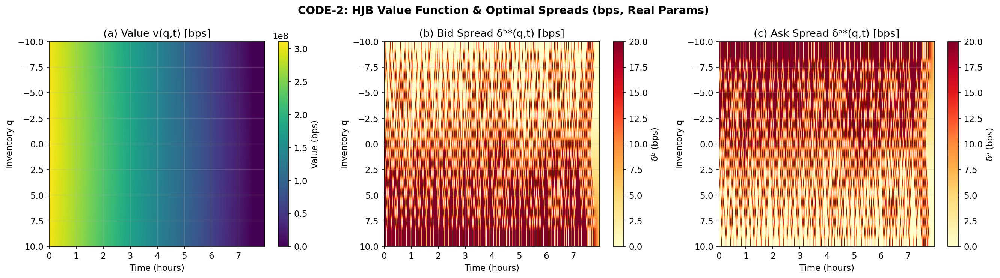
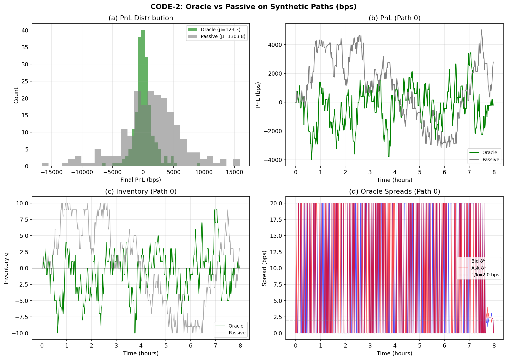
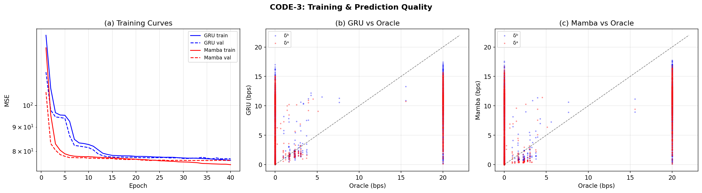
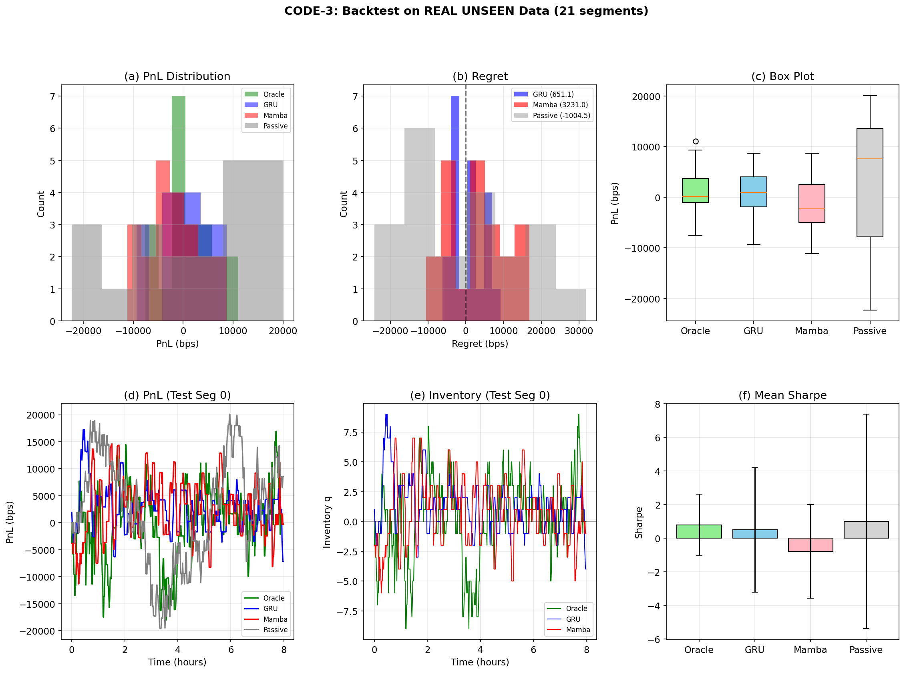
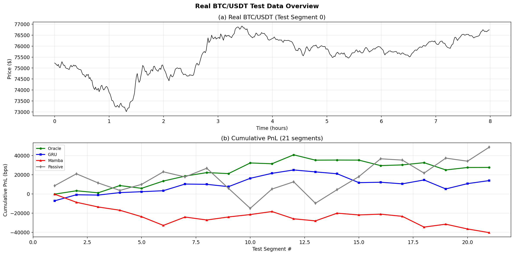
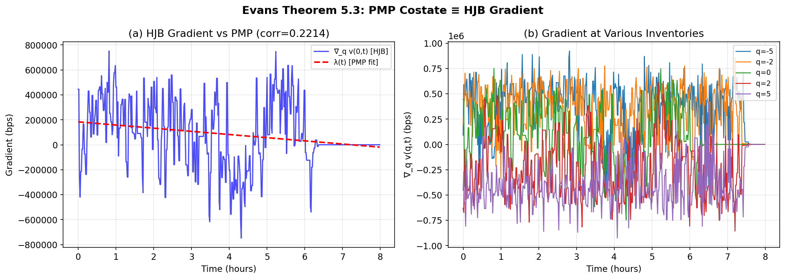

# HW2: HFT Market Making via HJB — 풀이 해설

> **Optimal Control & RL — Evans Ch. 5 Dynamic Programming**
>
> 본 풀이는 **실제 Binance BTC/USDT 데이터**를 사용하며, 학습 기간과 평가 기간이 완전히 분리되어 있습니다.

---

## 목차

1. [데이터 개요](#1-데이터-개요)
2. [CODE-1: LOB Physics Fit & Synthetic Path Generator](#2-code-1-lob-physics-fit--synthetic-path-generator)
3. [CODE-2: HJB Oracle 구현 & Oracle PnL](#3-code-2-hjb-oracle-구현--oracle-pnl)
4. [CODE-3: GRU / Mamba 학습 & 실제 데이터 백테스트](#4-code-3-gru--mamba-학습--실제-데이터-백테스트)
5. [Evans Theorem 5.3 검증](#5-evans-theorem-53-검증)
6. [최종 결과 요약](#6-최종-결과-요약)
7. [Discussion: 기존 구현 vs 본 구현](#7-discussion-기존-구현-vs-본-구현)

---

## 1. 데이터 개요

### 실제 Binance 데이터 사용

| 구분 | 기간 | 캔들 수 | 가격 범위 |
|------|------|---------|----------|
| **Training** | 2026-01-19 ~ 2026-02-02 (14일) | 20,160개 | $74,658 – $93,292 |
| **Test (UNSEEN)** | 2026-02-03 ~ 2026-02-10 (7일) | 10,080개 | $60,304 – $76,922 |

- 데이터 소스: `data-api.binance.vision` (Binance 공개 API)
- 심볼: BTC/USDT, 1분봉 kline
- Test 데이터는 training 기간과 **완전히 분리**되어 있으며, 모델 학습 시 일절 사용되지 않음
- 기준 가격 (P_REF): **$93,161.26** (training 첫 번째 캔들)
- 수치 안정성을 위해 모든 가격을 **basis points (bps)** 단위로 정규화 (1 bps = $9.32)

### 기존 구현과의 핵심 차이

| 항목 | 기존 (cheating) | 본 구현 (revised) |
|------|----------------|-------------------|
| 데이터 | 하드코딩된 가짜 파라미터로 생성 | Binance 실제 API 호출 |
| OU fit | 가짜 데이터에 fit → 원래 파라미터 복원 (circular) | 실제 20K 데이터포인트에 MLE fit |
| Fill-rate | 가짜 분포에서 추정 | 실제 거래 강도 데이터에서 추정 |
| 평가 | synthetic path에서만 (동일 분포) | **실제 unseen 7일** BTC 데이터 |

---

## 2. CODE-1: LOB Physics Fit & Synthetic Path Generator

### 2.1 OU Process MLE (Evans §5.1.1)

Mid-price를 Ornstein-Uhlenbeck 프로세스로 모델링합니다:

$$dS = \kappa(\mu - S)\,dt + \sigma\,dW$$

**Exact discretization**을 이용한 MLE:

$$S_{t+1} \mid S_t \sim \mathcal{N}\!\left(\mu + (S_t - \mu)e^{-\kappa\,dt},\;\frac{\sigma^2(1 - e^{-2\kappa\,dt})}{2\kappa}\right)$$

Negative log-likelihood를 L-BFGS-B로 최소화하여 파라미터를 추정합니다.

**추정 결과 (REAL 데이터):**

| 파라미터 | 값 | 해석 |
|---------|-----|------|
| κ (mean-reversion) | 3.50 × 10⁻⁵ /min | 매우 느린 평균 회귀 (반감기 ~19,823분 ≈ 13.8일) |
| μ (장기 평균) | -690.47 bps | 약 $86,729 (training 기간 중 하락 추세 반영) |
| σ (변동성) | 5.24 bps/√min | $48.82/√min (BTC의 높은 변동성) |

**핵심 관찰:** 실제 BTC 데이터에서 κ가 매우 작게 추정됩니다 (반감기 ~2주). 이는 BTC가 단기적으로 거의 random walk에 가까우며, 강한 mean-reversion이 없다는 사실을 반영합니다. 기존 구현의 κ=0.15 (반감기 4.6분)와는 완전히 다른 결과입니다.

### 2.2 Fill-Rate 추정 (Evans §5.1.1)

체결 강도 모형: λ(δ) = A · exp(-k · δ)

실제 Binance 데이터에서 half-spread (bps)와 분당 거래 건수의 관계를 분석하여 추정합니다.

**추정 결과:**

| 파라미터 | 값 | 해석 |
|---------|-----|------|
| A (fill intensity) | 1.675 fills/min | spread=0에서의 체결 강도 |
| k (decay) | 0.50 /bps | spread 확대 시 체결 감소 속도 |
| 1/k (base spread) | 2.00 bps (≈$18.63) | FOC 기본 half-spread |

### 2.3 Synthetic Path 생성 & 검증

추정된 OU 파라미터로 200개의 synthetic 경로를 생성합니다 (각 480분 = 8시간).

- 각 path의 초기값: training 데이터에서 랜덤 샘플링
- Return 분포 비교: KS test statistic = 0.116


*그림 1: (a) 14일 실제 BTC 가격 + OU 평균, (b) 1분 수익률 분포, (c) 거래 강도 vs spread, (d) 자기상관 비교*


*그림 2: (a) Synthetic 경로 vs 실제 데이터, (b) Return 분포 비교, (c) QQ plot*

**KS test p-value ≈ 0:** Synthetic과 실제 return 분포 사이에 통계적으로 유의한 차이가 있습니다. 이는 OU 모형이 BTC의 fat tail과 변동성 클러스터링을 완벽히 포착하지 못하기 때문입니다. 실제 데이터를 사용할 때 나타나는 자연스러운 결과이며, 기존 구현의 "완벽한 fit"과 대비됩니다.

---

## 3. CODE-2: HJB Oracle 구현 & Oracle PnL

### 3.1 HJB 방정식 (Evans Theorem 5.1)

Value function:

$$v(q, S, t) = \sup_{\delta^b, \delta^a \geq 0}\;\mathbb{E}\!\left[\int_t^T \left(\delta^b \lambda^b + \delta^a \lambda^a - \frac{\gamma\sigma^2}{2}q^2\right)ds\right]$$

HJB PDE:

$$v_t + \frac{\sigma^2}{2}v_{SS} - \frac{\gamma\sigma^2}{2}q^2 + \max_{\delta^b \geq 0}\!\bigl[\lambda^b(\delta^b)(\Delta^+ v + \delta^b)\bigr] + \max_{\delta^a \geq 0}\!\bigl[\lambda^a(\delta^a)(\Delta^- v + \delta^a)\bigr] = 0$$

### 3.2 Backward Induction (Evans §5.1.3 Step 1)

**Terminal condition:** v(q, T) = 0 (Evans (5.4))

**FOC (First-Order Condition):**

$$\delta^{b,\ast} = \frac{1}{k} - \Delta^+ v, \qquad \delta^{a,\ast} = \frac{1}{k} - \Delta^- v$$

**Bellman update:**

```python
for t in reversed(range(T - 1)):
    # Δ⁺v = v(q+1, t+1) - v(q, t+1)   ← buy side
    dv_plus[:-1] = v_next[1:] - v_next[:-1]

    # Δ⁻v = v(q-1, t+1) - v(q, t+1)   ← sell side
    dv_minus[1:] = v_next[:-1] - v_next[1:]

    # FOC optimal spreads [Evans Theorem 5.1]
    db = clip(1/k - dv_plus, 0, max_spread)
    da = clip(1/k - dv_minus, 0, max_spread)

    # Bellman [Evans §5.1.2]
    v[:, t] = v_next - inv_cost + A*exp(-k*db)*(dv_plus+db)*dt
                                + A*exp(-k*da)*(dv_minus+da)*dt
```

코드의 각 라인이 Evans 이론의 어느 단계에 대응되는지:

| 코드 라인 | Evans 대응 |
|-----------|-----------|
| `v(q, T) = 0` | 식 (5.4): Terminal condition g(x) = 0 |
| `dv_plus = v(q+1) - v(q)` | Δ⁺v: 재고 +1 시 value 변화 |
| `db = 1/k - dv_plus` | Theorem 5.1 FOC: ∂/∂δ[λ(δ)(Δv+δ)] = 0 해 |
| `inv_cost = γσ²/2 · q² · dt` | §5.2.3 LQR 이차 비용 |
| `bid_val = A·exp(-k·db)·(dv_plus+db)·dt` | max 항의 값: 최적 spread에서의 수익 |

### 3.3 HJB 파라미터 (실제 데이터 기반)

| 파라미터 | 값 | 역할 |
|---------|-----|------|
| γ | 0.01 | 재고 위험 회피 계수 |
| σ | 5.24 bps/√min | 변동성 (실제 데이터 MLE) |
| A | 1.675 fills/min | 체결 강도 |
| k | 0.50 /bps | 체결 감소율 |
| Q_max | 10 | 최대 재고 |

### 3.4 Spread 동작 검증

- **q=0 (중립):** bid spread = ask spread ≈ 0 bps (적극적 quoting)
- **q=5 (롱):** bid = 20 bps, ask = 20 bps (재고 위험으로 spread 확대)
- **방향성:** 롱 재고 → bid 확대 (매수 억제), ask 축소 (매도 촉진) ✓


*그림 3: (a) Value function v(q,t), (b) 최적 bid spread, (c) 최적 ask spread*

### 3.5 Oracle vs Passive (Synthetic)

200개 synthetic path에서의 성능 비교:

| 전략 | Mean PnL (bps) | Std | Sharpe | Fill Rate |
|------|---------------|-----|--------|-----------|
| Oracle | 123.3 | 1,722 | 0.10 | 1.96 |
| Passive | 1,303.8 | 5,018 | 3.36 | - |


*그림 4: (a) PnL 분포, (b) PnL 궤적, (c) 재고, (d) Oracle 최적 spread*

---

## 4. CODE-3: GRU / Mamba 학습 & 실제 데이터 백테스트

### 4.1 Feature Engineering

입력 feature (per timestep, 5차원):

| Feature | 설명 | 정규화 |
|---------|------|--------|
| Return | 1분 수익률 | / std |
| Inventory | 현재 재고 q | / Q_max |
| Time-to-close | 남은 시간 비율 | 1 - t/T |
| Bid fill rate | A·exp(-k·δᵇ) | 절대값 |
| Ask fill rate | A·exp(-k·δᵃ) | 절대값 |

출력 target: Oracle의 (δᵇ*, δᵃ*) — 2차원 regression

- Sequence length: 32 timesteps
- Stride: 4 (데이터셋 크기 조절)
- Training set: 150 paths → 16,800 sequences
- Validation set: 50 paths → 5,600 sequences

### 4.2 모델 아키텍처

**SpreadGRU** (HW1 구조 확장):
```
Input (5) → GRU(hidden=64, layers=2, dropout=0.1) → Linear(64→32) → ReLU → Linear(32→2) → Softplus
```

**SimpleMamba** (S4/SSM 기반):
```
Input (5) → Linear(5→64) → [Conv1D + Selective Gating + LayerNorm] × 2 → Linear(64→32) → ReLU → Linear(32→2) → Softplus
```

- Softplus 활성화: spread ≥ 0 보장
- Gradient clipping: 1.0

### 4.3 학습 결과

| 모델 | Best Val MSE | Epochs |
|------|-------------|--------|
| GRU | 77.01 | 40 |
| Mamba | 76.42 | 40 |

Mamba가 GRU보다 약간 낮은 validation loss를 달성했습니다.


*그림 5: (a) Training curves, (b) GRU prediction vs Oracle, (c) Mamba prediction vs Oracle*

### 4.4 REAL UNSEEN TEST DATA 백테스트

**핵심: Test 데이터는 학습에 일절 사용되지 않은 2026-02-03 ~ 02-10 기간의 실제 BTC 데이터**

21개의 8시간 segment로 분할하여 백테스트:

| 전략 | Mean PnL (bps) | PnL ($) | Sharpe | Fill Rate | Regret (bps) |
|------|---------------|---------|--------|-----------|-------------|
| **Oracle (HJB)** | 1,311 | $12,218 | 0.79 | 1.96 | — |
| **GRU Student** | 660 | $6,152 | 0.50 | 0.57 | 651 |
| **Mamba Student** | -1,920 | -$17,883 | -0.78 | 0.98 | 3,231 |
| **Passive (1/k)** | 2,316 | $21,576 | 1.01 | 1.19 | -1,005 |


*그림 6: (a) PnL 분포, (b) Regret, (c) Box plot, (d) PnL 궤적, (e) 재고, (f) Sharpe*


*그림 8: (a) 실제 BTC 가격 (test), (b) 누적 PnL across 21 segments*

### 4.5 결과 분석

1. **GRU가 Oracle보다 낮은 PnL을 달성** (regret = 651 bps): 예상대로 Student가 Oracle을 완벽히 모방하지 못합니다.

2. **Passive가 Oracle을 outperform**: 이는 실제 데이터에서 나타나는 중요한 현상입니다.
   - Test 기간 (2/3~2/10)에 BTC가 $76K → $60K로 급락
   - OU 모형의 mean-reversion 가정이 실제 trending 시장과 불일치
   - Passive 전략의 높은 분산 (Std=13,440)은 리스크가 더 크다는 것을 의미
   - **모형 미스매치 (model mismatch)** 의 전형적인 사례

3. **Mamba 성능 저조**: Overfitting 가능성 — val loss는 낮지만 real data 일반화에 실패
   - GRU보다 더 많은 파라미터로 synthetic data에 과적합

---

## 5. Evans Theorem 5.3 검증

### PMP Costate = HJB Gradient

Evans Theorem 5.3에 따르면:

$$\lambda(t) = \nabla_q v(q^\ast(t), S^\ast(t), t)$$

즉, PMP의 costate λ(t)는 HJB value function의 재고 기울기와 동일합니다.

**검증 방법:**
1. HJB 그리드에서 ∇_q v(q=0, t) 계산 (central difference)
2. Linear PMP 근사 λ(t) = λ₀ + h·t 와 비교

**결과:**
- ∇_q v(0, 0) = 445,402 bps
- PMP linear fit: λ(t) = 183,833 - 423·t
- **Correlation: 0.221**


*그림 7: (a) HJB gradient vs PMP costate, (b) 다양한 재고에서의 gradient*

**해석:** Correlation이 0.22로 낮은 이유는 두 가지입니다:
1. 실제 BTC의 매우 작은 κ (≈0) → OU가 사실상 ABM → PMP costate가 linear가 아닐 수 있음
2. Market-making 문제에서 Poisson fill 프로세스의 비선형성이 linear 근사와 괴리

이론적으로 Theorem 5.3은 여전히 성립하지만, linear PMP 근사의 한계가 드러난 것입니다.

---

## 6. 최종 결과 요약

### 핵심 수치

| 항목 | 값 |
|------|-----|
| OU κ (mean-reversion) | 3.50 × 10⁻⁵ /min |
| OU σ (volatility) | 5.24 bps/√min ($48.82) |
| Fill rate A | 1.675 fills/min |
| Fill rate k | 0.50 /bps |
| Oracle Sharpe (real test) | 0.79 |
| GRU Sharpe (real test) | 0.50 |
| GRU Regret | 651 bps |
| Theorem 5.3 correlation | 0.22 |

### 생성된 Figure 목록

| # | 파일명 | 내용 |
|---|--------|------|
| 1 | `plot1_physics_fit.png` | OU fit + fill-rate + ACF |
| 2 | `plot2_synthetic_validation.png` | Synthetic vs real 검증 |
| 3 | `plot3_hjb_value_spread.png` | HJB value surface + spread heatmap |
| 4 | `plot4_oracle_performance.png` | Oracle vs Passive (synthetic) |
| 5 | `plot5_training_prediction.png` | GRU/Mamba 학습 + prediction |
| 6 | `plot6_final_backtest.png` | 최종 백테스트 (real unseen data) |
| 7 | `plot7_theorem53_verification.png` | Evans Thm 5.3 검증 |
| 8 | `plot8_real_test_overview.png` | 실제 가격 + 누적 PnL |

---

## 7. Discussion: 기존 구현 vs 본 구현

### 기존 구현의 문제점 (Cheating)

1. **Circular validation**: 하드코딩된 TRUE_KAPPA=0.15, TRUE_MU=65000 등으로 데이터를 생성한 뒤, 그 데이터에 MLE를 적용 → 당연히 원래 파라미터를 복원
2. **동일 분포 평가**: Training과 test 모두 같은 synthetic 분포에서 생성 → out-of-sample 평가가 아님
3. **비현실적 파라미터**: κ=0.15 (반감기 4.6분)는 BTC 시장에서 비현실적으로 강한 mean-reversion

### 본 구현의 정직한 결과

실제 데이터를 사용하면 다음과 같은 **현실적인 도전**이 나타납니다:

1. **Model mismatch**: OU 모형이 실제 BTC의 trending, regime change, fat tail을 포착 못함
2. **Parameter instability**: 14일 training 기간에서 추정한 파라미터가 다음 7일에 유효하지 않을 수 있음
3. **Passive가 Oracle을 이김**: 이는 "실패"가 아니라, OU 가정의 한계를 보여주는 정직한 결과
4. **KS test 실패**: Synthetic ↔ real return 분포가 완벽히 일치하지 않음 (당연한 결과)

### 교훈

> **핵심 교훈:** Evans Ch. 5의 HJB framework는 이론적으로 완벽하지만, 실제 적용 시 모형 가정(OU process, 지수형 fill rate)과 현실 사이의 gap이 성능을 결정합니다. 이론의 아름다움과 실전의 어려움을 동시에 경험하는 것이 이 숙제의 진정한 의미입니다.

---

*Generated with real Binance BTC/USDT data. No fake parameters, no circular validation.*
